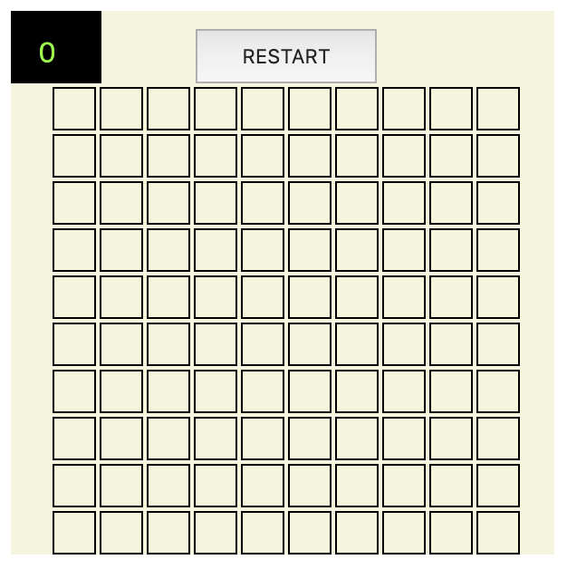
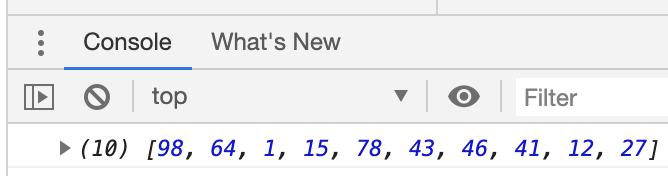
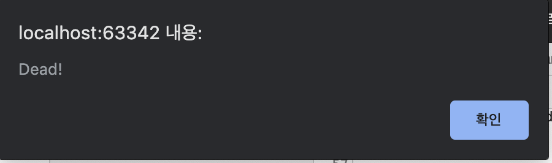
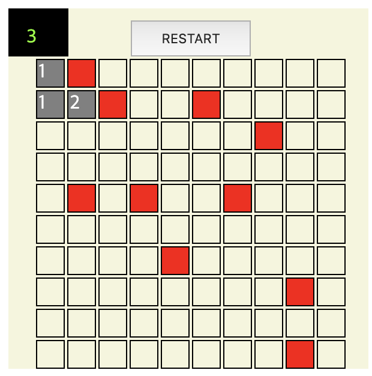

Simple-Minesweeper
---

Make, Play, Enjoy!

| Initial array status | Mines array with console |
|:----------------------------------------:|:-----------------------------------------:|
|||

| Dead image - alert | Dead image - Area |
|:----------------------------------------:|:-----------------------------------------:|
|||

If you press any one of the sequences, the game starts.

When the game starts, the number goes up every second in the upper left black box.

- How to play?
   - Just double-click on the index.html.
   - It's optimized for Chrome(75.0.3).

- A point of interest
   - Time control.
   - Array control.
   - Dom control with EventListener
   - BFS.

License
---
This is released under the MIT license. See [LICENSE](LICENSE) for details.

